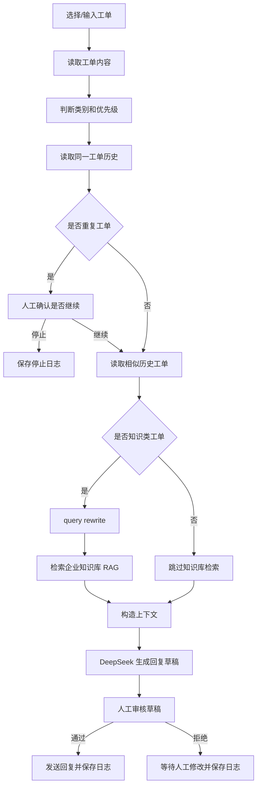

# Enterprise Ticket Agent Assistant

一个可本地运行的企业工单处理 Agent。项目支持工单分类、优先级判断、企业知识库 RAG 检索、历史记忆、重复工单确认、DeepSeek 回复草稿生成、人工审核、处理日志持久化，以及分类/策略/记忆检索评估。

这个项目是 Agent 应用开发学习路线中的第二个作品项目，重点展示：

- LangGraph 多节点 Agent 编排
- Tool Calling 思想在业务流程中的落地
- RAG 与工单处理结合
- Memory / State / Human-in-the-loop
- 日志、评估和可观测性
- Streamlit 产品化页面

## 功能亮点

- 模拟企业工单数据
- 工单分类和优先级判断
- 知识类工单 query rewrite
- 企业知识库 RAG 检索
- DeepSeek 生成客服回复草稿
- 同一工单历史读取
- 重复工单前置确认
- 相似历史工单记忆
- Streamlit 网页审核页面
- 回复草稿编辑和人工审核
- 审核通过发送，审核拒绝等待人工修改
- 工单处理日志本地保存
- 日志统计和最近处理记录查看
- 分类和优先级评估
- 重复工单策略评估
- 历史记忆检索评估
- 一键评估总览报告

## 技术栈

- Python
- Streamlit
- LangGraph
- LangChain
- DeepSeek API
- 企业知识库 RAG
- BM25 / 向量检索
- JSON 日志持久化

## 项目结构

```text
ticket-agent-assistant/
├── ticket_agent/
│   ├── agent.py
│   ├── classifier.py
│   ├── llm.py
│   ├── policy.py
│   ├── rag.py
│   ├── storage.py
│   ├── ticket_data.py
│   └── web_workflow.py
├── data/
│   ├── classification_eval_report.json
│   ├── duplicate_policy_eval_report.json
│   ├── evaluation_summary.json
│   └── memory_retrieval_eval_report.json
├── main.py
├── streamlit_app.py
├── analyze_logs.py
├── eval_classification.py
├── eval_duplicate_policy.py
├── eval_memory_retrieval.py
├── inspect_memory.py
├── run_all_evals.py
├── MEMORY_STATE_HITL_SUMMARY.md
├── STREAMLIT_PRODUCT_SUMMARY.md
├── PROJECT_REVIEW.md
├── README_LEARNING_NOTES.md
├── requirements.txt
├── .env.example
├── .gitignore
└── README.md
```

运行后会自动生成：

```text
data/ticket_process_log.json
```

该运行日志已被 `.gitignore` 忽略，避免把本地测试记录提交到 GitHub。

## 安装

```bash
cd ticket-agent-assistant
python3 -m venv .venv
source .venv/bin/activate
pip install -r requirements.txt
```

如果你是在本学习项目总目录中运行，也可以复用上层虚拟环境：

```bash
cd /Users/yaohe/Desktop/agent—study/ticket-agent-assistant
source ../.venv/bin/activate
pip install -r requirements.txt
```

## 配置

复制环境变量模板：

```bash
cp .env.example .env
```

编辑 `.env`：

```text
DEEPSEEK_API_KEY=你的 DeepSeek API Key
```

注意：不要把 `.env` 提交到 GitHub。

## 运行 Streamlit 网页版

```bash
streamlit run streamlit_app.py --server.port 8502
```

浏览器打开：

```text
http://localhost:8502
```

页面支持：

- 选择工单
- 生成处理草稿
- 重复工单风险确认
- 查看同一工单历史
- 查看相似历史工单
- 查看 RAG 查询改写和知识库资料
- 编辑回复草稿
- 人工审核发送或取消
- 查看日志统计和最近处理记录

## 运行命令行版本

```bash
python main.py
```

可测试工单编号：

```text
T1001
T1002
T1003
```

## 示例工单

```text
T1001：用户反馈：知识库问答没有找到产品介绍，希望尽快处理。
T1002：用户反馈：想了解蓝海科技适合哪些人群使用。
T1003：用户反馈：系统页面打不开，影响今天的培训课程。
```

## Agent 流程



## 评估

项目包含三个评估脚本：

```bash
python eval_classification.py
python eval_duplicate_policy.py
python eval_memory_retrieval.py
```

也可以一键运行全部评估：

```bash
python run_all_evals.py
```

评估报告会写入：

```text
data/classification_eval_report.json
data/duplicate_policy_eval_report.json
data/memory_retrieval_eval_report.json
data/evaluation_summary.json
```

当前评估覆盖：

- 工单分类是否正确
- 优先级判断是否正确
- 重复工单策略是否符合预期
- 相似历史工单是否能被正确召回

## 日志与记忆

工单处理日志保存在：

```text
data/ticket_process_log.json
```

日志记录：

- 工单编号和内容
- 工单类别和优先级
- 是否使用知识库资料
- 同一工单历史次数
- 重复工单确认结果
- 是否使用历史记忆
- 参考过的历史工单编号
- 回复草稿
- 人工审核结果
- 最终状态

查看日志统计：

```bash
python analyze_logs.py
```

检查某个工单会匹配到哪些历史记忆：

```bash
python inspect_memory.py
```

## 文档

- `README_LEARNING_NOTES.md`：原始学习版 README，保留详细学习记录
- `MEMORY_STATE_HITL_SUMMARY.md`：记忆、状态和人工确认阶段总结
- `STREAMLIT_PRODUCT_SUMMARY.md`：Streamlit 产品化阶段总结
- `PROJECT_REVIEW.md`：项目复盘、架构说明和面试讲解材料

## 注意事项

- 不要提交 `.env`
- 不要提交 `.venv`
- 不要提交 `data/ticket_process_log.json`
- `data/*_report.json` 是评估报告，可以提交用于展示项目效果
- 如果 DeepSeek 调用失败，请检查 API Key、网络和代理
- 如果首次加载企业知识库 RAG 较慢，属于正常现象
